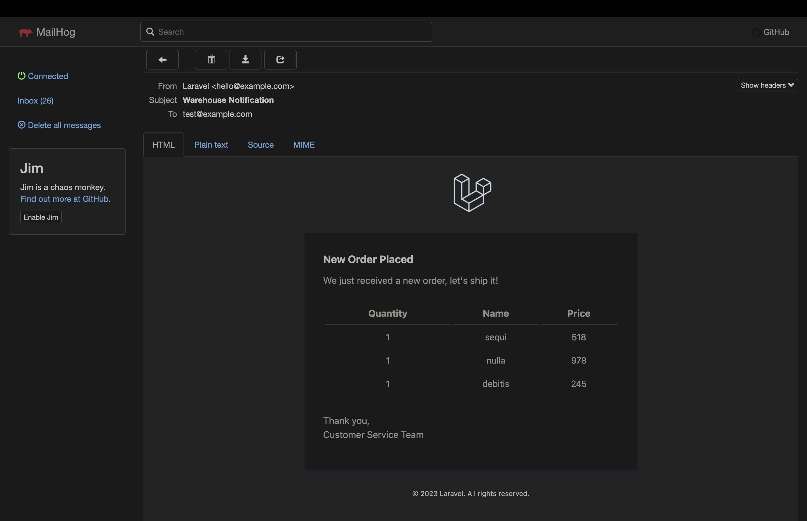

# Online Shop API



## Run it
```
composer install
php artisan key:generate
php artisan passport:install
php artisan migrate --seed
php artisan tinker // run next line on psyshell and copy outputted token to Postman
    User::where('name', 'Test User')->first()->createToken('integration');
php artisan serve 
```


### Testing sending emails in a local environment
1. Install Mailhog via Homebrew: `brew install mailhog`
2. Update your Laravel `.env` file to use Mailhog as the mail driver:
3. Run it: `mailhog`

```
MAIL_DRIVER=smtp
MAIL_HOST=localhost
MAIL_PORT=1025
MAIL_USERNAME=null
MAIL_PASSWORD=null
MAIL_ENCRYPTION=null
```

4. Visit http://localhost:8025 to see the dashboard and sent emails. 

Now any emails sent will be caught by Mailhog.
